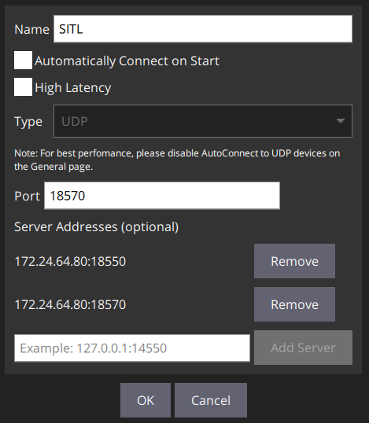

# Roboboat Simulator

## READ BEFORE CONTINUE

> ⚠️ **MAKE SURE** you build the **correct image AND run commands**!

Files ending with `.[host_os]-[gpu]` should match your system availability.

For example, the companion Zotac PC only has an Intel GPU with Ubuntu on it, so
use the `Dockerfile.linux-intel` file when building!

By default, these are now build with no NVIDIA GPU support, and their run
scripts do not account for `nvidia-docker2` either!

## Build Instructions

Make the script executable and run with `./script_name` if you want...

```console
> cd /path/to/cloned/dir/
> cd Docker
> bash build.sh
```

## Running

Assuming you build the correct image, which should be named
`roboboat:simulator-intel` by default, run

```console
> bash run.sh
```

This will start a container in background. Check with `docker ps`.

Subsequent run of the same script will either start the container if not
started, or attach to it and give you an internal `bash` prompt.

```console
> bash run.sh
root@host:~#
```

## Develop

There are two primary thing you want to know

1. The `roboboat-code` directory, which stores sample Python programs.
2. The `roboboat-model` directory, which have scripts that spawns the correct
   boat and environment.

Both are located under `/root/src`

To start the environment, run `bash /root/src/roboboat-model/spawn_env.sh`

To spawn the buoy for Task 1 in the Roboboat 2022 Manual, in a separate
terminal, run `python /root/src/roboboat-code/spawn_buoys.py`


### Network Connection on WSL2

Container run scripts have been updated with publishing all the ports required
by QGroundControl. To let QGC connects to the container, first locate the IP
address of your WSL instance.

> ⚠️ this is a **dynamic IP** and it **WILL CHANGE AFTER REBOOT**

```console
user@host:~$ ip a
...

6: eth0: <BROADCAST,MULTICAST,UP,LOWER_UP> mtu 1500 qdisc mq state UP group default qlen 1000
    link/ether 00:15:5d:c7:8a:49 brd ff:ff:ff:ff:ff:ff
    inet 172.24.64.80/20 brd 172.24.79.255 scope global eth0

...
```

or

```console
user@host:~$ ifconfig
...

eth0: flags=4163<UP,BROADCAST,RUNNING,MULTICAST>  mtu 1500
        inet 172.24.64.80  netmask 255.255.240.0  broadcast 172.24.79.255
        inet6 fe80::215:5dff:fec7:8a49  prefixlen 64  scopeid 0x20<link>

...
```

We care bout the `inet`, which is the address of our WSL that docker exposed the
specified ports to.

In QGC, go to Application Settings > Comm Links, and add our IP address with the
appropriate ports.

