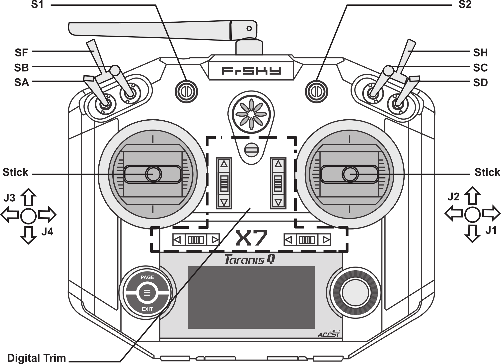
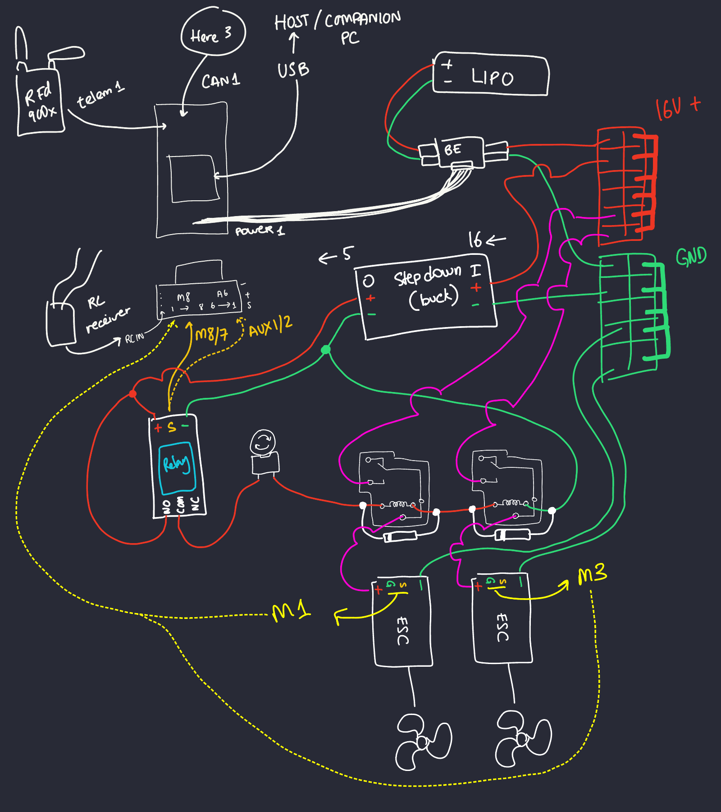

# An Overview of Status Quo

So, this is a one-sided summary of current development status.

This is referencing [Official Roboboat Manual](https://robonation.org/app/uploads/sites/3/2022/05/2022-RoboBoat_Team-Handbook_v3.pdf), amongst other guides.

## Hardware

### Manual Control

As in drive the boat using the Taranis remote control (from now on referred to as RC).

I have made sure that the parameters are configured such that the boat can be controlled through specified input. For now, try not to mess with the RC configuration.

See [Schematic and Part List](#schematic-and-part-listchematic) to see which stick responsible for what.

> :warning: I have **disabled safety switch**! Meaning the only thing that is stopping the motor from turning is the arm/disarm switch. BE VERY CAREFUL!

### On-Board Emergency Stop System (E-Stop)

Basically a big red button so organizing peeps can hit it with say a paddle and it will kill power to motor. I have included specific instruction on where to obtain parts, and how to wire them down below.

At the time of writing this, this is a non-negotiable requirement, as in ground for dismissal/disqualification, for the boat, and **IT IS NOT YET RESOLVED!**

### Wireless E-Stop

I have configured such that multiple relays modules can be enabled/disabled using RC channels. I have also included specific instructions down below. Again, this is also ground for dismissal, and it is also not yet addressed...

## Software

### Cube Orange Firmware

Choices were made because PX4 simply does not support Relay control, which is required for safety requirements (refer to latest [RoboBoat Manual](https://robonation.org/app/uploads/sites/3/2022/05/2022-RoboBoat_Team-Handbook_v3.pdf)). This decision practically forces us to rewrite our code base from scratch as Ardupilot firmware does not support the entire instruction set that MAVSDK support, which is meant for PX4.

See [this issue](https://github.com/mavlink/MAVSDK/issues/728#issuecomment-1307368833) where the most effective way to test MAVSDK support is to install Ardupilot then test each instructions one by one.

So, we are now on Ardupilot Official Rover 4.3.2, and not PX4 Pro.

### What Now?

Not all hope is loss, but it is cutting it close. Really flippin close.

We now use something called `pymavlink`, and while the official API documentation is non-existant, Ardusub community (ironically the people who made the T200 thrusters and peeps from BlueRobotics), has a stack of examples available [on this ArduSub guide](https://www.ardusub.com/developers/pymavlink.html#shortcut-links).

Since the competition is expected to be fully autonomous, a rather simplified pseudocode loop would be as follows:

```
status = GET_STATUS()
WHILE true
    IF status IN [error, standby, failsafe, ...]
        MAINTAIN_CURRENT_POSITION()
        SLEEP 1
    ELSE
        buoys = FIND_BUOYS()
        IF buoys IS EMPTY:
            buoy = DYNAMIC_FIND_BUOYS()
        heading = GET_HEADING()
        delta = heading - BUOY_CENTER(buoys)
        IF delta > 5:
            INCREASE_LEFT_THRUSTER()
        ELSE IF delta < 5:
            INCREASE_RIGHT_THRUSTER()
        ELSE:
            MAINTAIN_THRUSTER()
    status = GET_STATUS()
```

So, for an endless loop, we are watching for a few things.

If we are in a standby state, could be anything from waiting for start signal from referee, to sudden loss of GPS, we hold position and wait for further instruction. We should also catch status that are important to us, say we flipped remote e-stop.

If we are not in standby, meaning we activated autopilot, we should assume we can find the buoys right away, or at least locate them somehow if nothing is visible. We then calculate where we ought to move (ideally in between the buoys) and what's our current heading (where we are looking at). From this we can calculate where to go, or more precisely which motor to speed up or slow down such that our heading now go towards the space in-between the buoys.

Obstacle avoidance is a bit more tricky, because we now need to stay in between red and green buoy but have to dodge black or yellow buoy somewhere in the middle of that. So, what we can do is find red and green buoy, then find obstacle buoy, calculate the gap between them, and aim at the center of the larger gap.

This should get us somewhere. Not very far, but somewhere.

## Schematic and Part List

### Radio Mapping



- SF is arm/disarm switch.
- SH is software e-stop (double check)
- SB and SC controls left and right thruster enable/disable, respectively.
- SD sets the autopilot in one of three modes: Manual, Hold, and Auto.
- J3 (vertical left stick) is throttle. Idle at center, down reverse, up forward.
- J4 (horizontal left stick) is tank-steering. Idle at center, going left means left thruster slow down, right thruster speed up, going right is the reverse.
- SA, S1, S2, J1, J2, and all digital trims are not used.

There may be some changes in schematic so that we only really need one switch to kill both motor. But, we'll see...

### Wiring Diagram

While the [peeps at Blue Robotics do this](https://bluerobotics.com/learn/guide-to-the-thruster-commander/#connecting-the-battery-and-escs), I typically refrain from wiring LiPo power rails in such a way to minimize the chance recreating Pompeii with a LiPo fire by shorting.

Pardon my handwriting, hope it somewhat make it clear.



The two funky block above the ESC are the listed relays, see [Parts](#parts).

This way, both the remote and hardwired E-stop boils down to a single line of power across those relays.

### Testing the Circuit

Use a multimeter with continuity test to make sure all actuation are done correctly, for example, flipping SB or SC should toggle one of the motor enable/disable, depending on the PARAM file. At this point, the probe should be set between `NO` and `COM` on the relay, and the multimeter should beep loudly if the relay is active, meaning motor should be powered, and stop beeping when relay is inactive, meaning power is cut.

### Parts

Mouser (HQ is in Mansfield, about a 20 minutes drive from Martin) has all the parts, accepts will-call order (as in call in, pick up 2 hours later), and have all we needed in stock.

- [5V 40A relay](https://mou.sr/3n5GFBO), one for each thruster, so 2 total.
- [Flyback diode](https://www.mouser.com/ProductDetail/Diotec-Semiconductor/1N4007?qs=OlC7AqGiEDmK9mU1uTiCkg%3D%3D), one for each previous relay, so 2 total.

## Reality

Will we make it? Probably not. But we can try!

*insert famous last words memes*